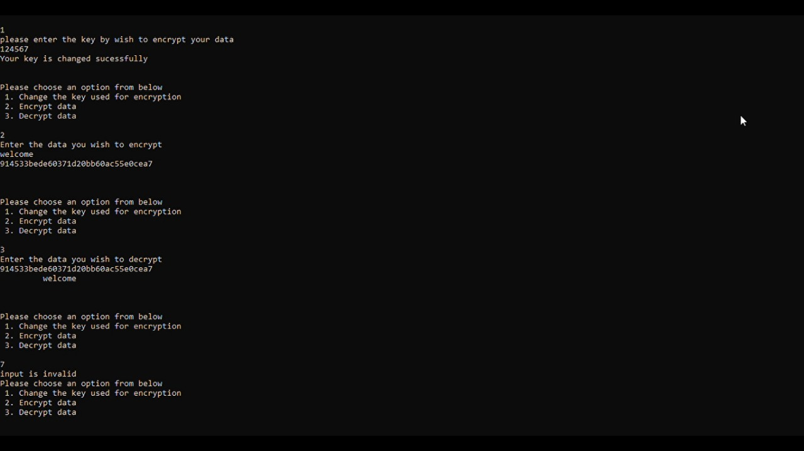

# Automate-the-synthesis-of-AES-algorithm-using-Verilog
We implement AES 128-bit Encryption and Decryption Algorithm using Verilog and automate it using Python Scripts
# Quick Start
Tools Required are 
1. Icarus Verilog Simulator 
2. Python IDLE
# Installation and Usage of Icarus Verilog
1.	Download the Icarus Verilog sources and binaries for different platforms using the following link http://bleyer.org/icarus/.
2.	Use a text Editor like Notepad++ to place you Encryption and Decryption algorithm as Verilog files (.v files)
3.	To compile the program, use the following command, 
    ``` 
    iverilog –o a.out encryption.v main_tb.v 
    ```
    Where "-o" flag tells the compiler where to place the compiled result. <br/>
    a.out stores the results of compilation in vvp format.<br/>
    Encryption.v is the main source file.<br/>
    main_tb.v is the test bench file.  

4.	To execute the compiled program, use 
    ```
    vvp a.out
    ```
5.	Similarly, we compile and execute the decryption codes.
    ``` 
    iverilog –o a1.out decryption.v main_tb_1.v
    
    vvp a1.out
    ```
    **Note** : we must run the commands from the bin folder where one downloaded the software.
    
6.	The other advantage of using Icarus Verilog other than compiling from the command prompt is the flexibility of providing the test bench inputs from the command line rather from the test bench file.
7.	To avoid the testbench recompiling and instead accept values from the command line just like any other scripting language like bash, we provide the test bench inputs are provided as an argument always starting with "+"
8.	The arguments passed from the command line are accesses in the System Verilog code using $value$plusargs
9.	The $value$plusargs system function also searches the list of plusargs like $test$plusargs, but it has the capability to get a value for a specified user string. If the prefix of one of the supplied plusargs  matches all characters in the given user string, the function will return a non-zero value and store the resulting value in the variable provided. If the user string is not found, then the function returns a non-zero value, and the variable will not be modified. The user string shall be of the form "plusarg_string format_string" where format strings are the same as $display tasks. These format identifiers are used to convert the value provided via command line to the given format and store in a variable.
10.	Use the following command to avoid recompilation of testbench files.
```
vvp a.out +data="welcome" +key="1234"
```
Where inputs of the testbench I.e. data is assigned as welcome string and key is assigned to 1234 string. The a.out is the compilation output file. 

# Installation and Usage of Python IDLE
1.	Download the latest version of python installer using the following link https://www.python.org/downloads/.

2.	To start an IDLE interactive shell, search for the IDLE icon in the start menu and double click on it.

3.	This will open IDLE, where you can write and  can execute Python statements same as in Python Shell.

4.	To execute a Python script, create a new file by selecting File -> New File from the menu.

5.	Enter multiple statements and save the file with extension .py using File -> Save. For example, as hello.py.

6.	Now, press F5 to run the script in the editor window. The IDLE shell will show the output.

7.	Thus, it is easy to write, test and run Python scripts in IDLE.

# Run
You can run the application using
1. Command Prompt 
2. Python GUI

**Note**

Give the path to bin folder of Icarus Verilog simulator in the subprocess.run() and os.system() methods written in Python Script.

## Command Prompt 

You need to open a command-line and type in the word python followed by the path to your script.

## Python GUI

Open your Python Script in Python IDLE and press F5 to run the application.

# Results




